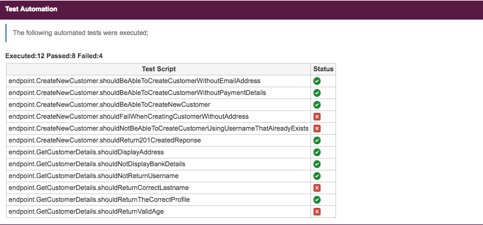

  

<h1 align="center"><code>JIRA</code> Comment Generator</h1>
<h3 align="center">Automatiicaly generate Jira comments as part of executing an Automated test suite</h3>

  Part of a group of super small repositories demonstrating some of the stuff I have done around Test Automation :necktie:

###

## Synopsis
Here is a quick demonstration on how you can generate `wiki markdown` as part of your automated test execution which highlights exactly what tests were ran. The markdown can then be pasted into Jira as a comment.

The comment can include as much information as you wish. For the purposes of this demo I included the following;
* The overall number of tests executed
* The overall number of tests passed / failed
* A list of all the tests which were executed and their status

#### Example

  

